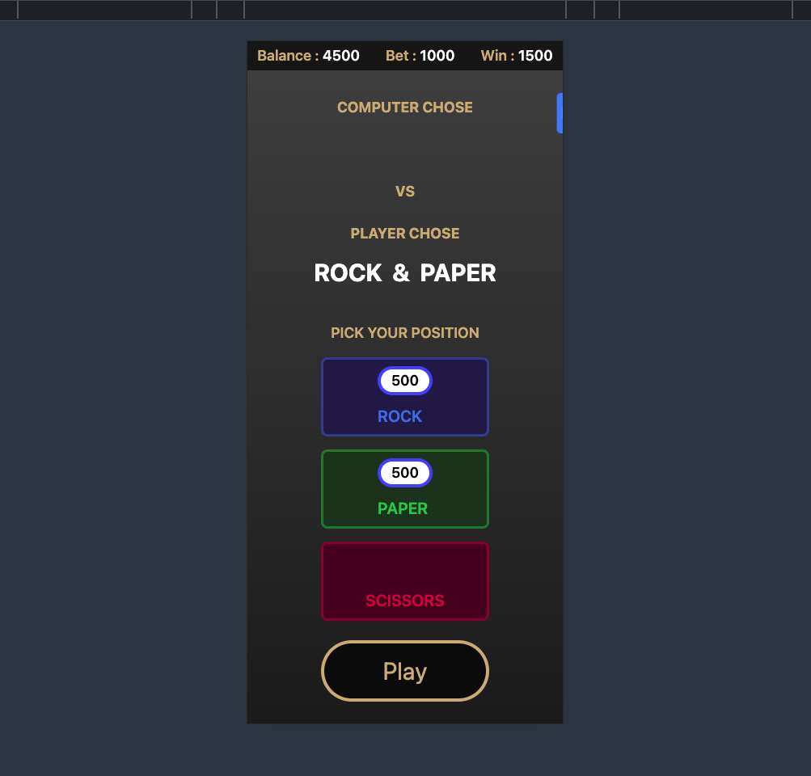
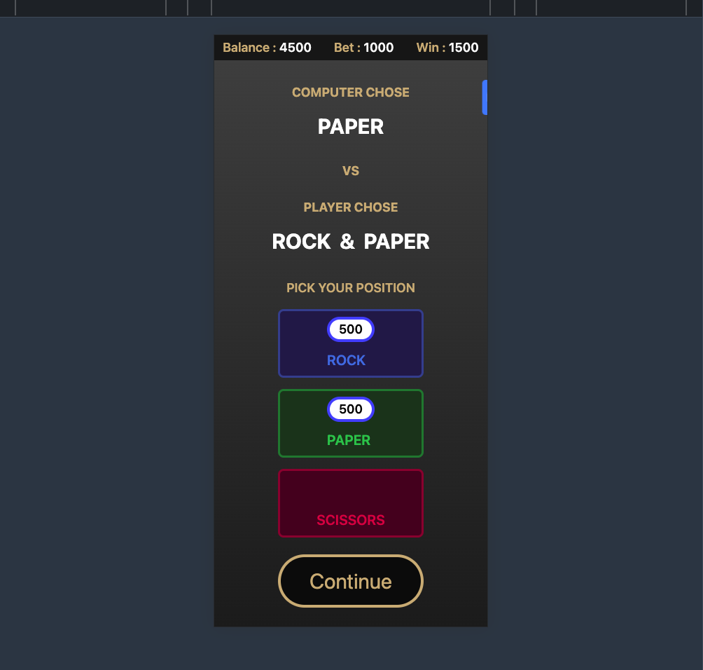
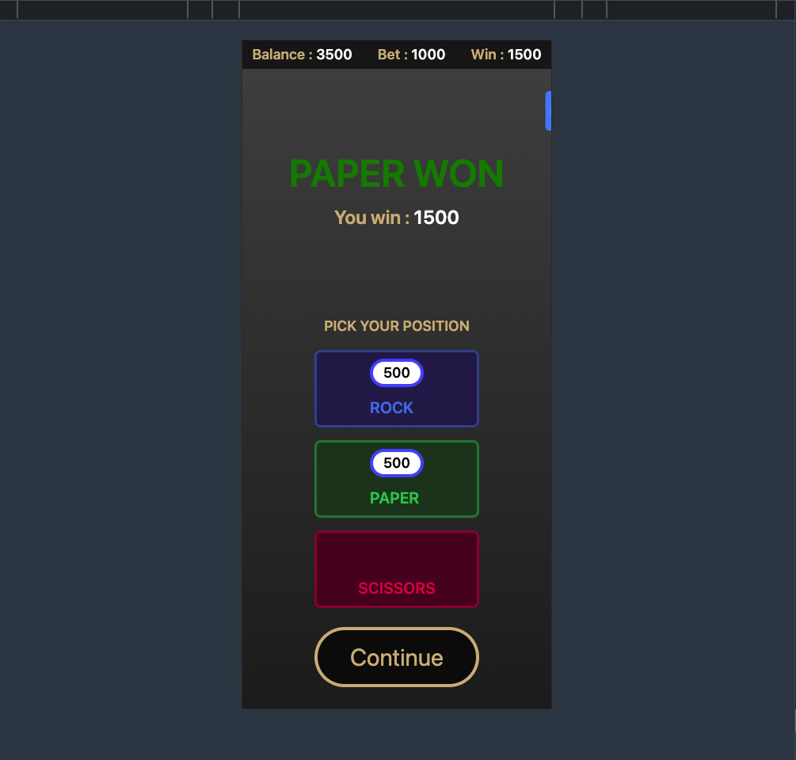

<a name="readme-top"></a>

<!-- PROJECT SHIELDS -->
<!--
*** I'm using markdown "reference style" links for readability.
*** Reference links are enclosed in brackets [ ] instead of parentheses ( ).
*** See the bottom of this document for the declaration of the reference variables
*** for contributors-url, forks-url, etc. This is an optional, concise syntax you may use.
*** https://www.markdownguide.org/basic-syntax/#reference-style-links
-->

[![Contributors][contributors-shield]][contributors-url]
[![Forks][forks-shield]][forks-url]
[![Stargazers][stars-shield]][stars-url]
[![Issues][issues-shield]][issues-url]
[![MIT License][license-shield]][license-url]
[![LinkedIn][linkedin-shield]][linkedin-url]

<div align="center">

  <h1 align="center">Rock Paper Scissors</h1>

  <p align="center">
    <a href="https://rock-paper-scissors-betting.netlify.app/">View Demo</a>
  </p>
</div>

<!-- TABLE OF CONTENTS -->
<details>
  <summary>Table of Contents</summary>
  <ol>
    <li>
      <a href="#about-the-project">Test Task specification</a>
    </li>
    <li><a href="#built-with">Built With</a></li>
    <li>
      <a href="#getting-started">Getting Started</a>
      <ul>
        <li><a href="#prerequisites">Prerequisites</a></li>
        <li><a href="#installation">Installation</a></li>
      </ul>
    </li>
    <li><a href="#usage">Usage</a></li>
    <li><a href="#roadmap">Roadmap</a></li>
    <li><a href="#contributing">Contributing</a></li>
    <li><a href="#license">License</a></li>
    <li><a href="#contact">Contact</a></li>
    <li><a href="#acknowledgments">Acknowledgments</a></li>

  </ol>
</details>

<!-- ABOUT THE PROJECT -->

## Test task specification

[![Product Name Screen Shot][product-screenshot1]](https://rock-paper-scissors-betting.netlify.app/)
[![Product Name Screen Shot][product-screenshot2]](https://rock-paper-scissors-betting.netlify.app/)
[![Product Name Screen Shot][product-screenshot3]](https://rock-paper-scissors-betting.netlify.app/)

Your test task is to create a React app, using Typescript with strict typing.
The app is a scissors, rock, paper game, with the ability to bet on the winning position.

### Specifications

- Player starts with a balance of 5000.
- Each bet should be 500 (player can place several bets on any position: 500, 1000,
  1500 etc)
- Player can not bet more than 2 positions per one game
- Winning rate for bet on 1 position is 14
- Winning rate for bet on 2 positions is 3

### Requirements

- There should be three betting positions, rock, paper, scissors.
- Player can bet on rock, paper, or scissors, but not on all three at the same time.
- The bet is reduced from the balance.
- When betting done button is clicked, the computer runs a random paper, scissors,
  rock match.
- Player choice should be compared to computers choice and only one bet can win –
  every tie counts as loss
- If player bets on one of them and wins, the return is 14 times the bet.
- If player bets on two of them and wins the return is 3 times the bet.
- Loss bets are not returned to player
- Bets with tie result are returned to player
- After round ends the return adds to the balance
- Player cannot bet if player has less balance than available for bet.

NB please keep in mind that Title ROCK vs PAPER on the second screen means “computer choice ROCK versus player choice PAPER” — not ROCK bet vs PAPER bet.

### Acceptance criteria

Every point of task should be implemented

#### Junior level

In general implementing every point is enough for junior. Optionally we pay attention to such things as concistency, variable naming, files and folders structure.

#### Middle level

We pay attention to everything mentioned for Junior (optional part is mandatory for middle). Additionally we check UX and compare UI with mockups more thorough and we expect following clean code principles

#### Senior level

We pay attention to everything mentioned for middle. Additionally we expect code to be flexible and maintainable. Changing of requirements should not lead to rewriting half of application. Changing of specifications should cause minimal changes.

<p align="right">(<a href="#readme-top">back to top</a>)</p>

## Built With

- [React][React-url]
- [Vite][Vite-url]
- [TailwindCSS][TailwindCSS-url]
- [React-toastify][React-toastify-url]
- [Framer Motion][Framer-motion-url]
- [Vitest][Vitest-url]
- [React Testing Library][React-Testing-Library-url]

<p align="right">(<a href="#readme-top">back to top</a>)</p>

<!-- GETTING STARTED -->

## Getting Started

<a href="https://rock-paper-scissors-betting.netlify.app/">View Demo</a>

### Installation

1. Clone the repo

   ```sh
   git clone https://github.com/shashtag/rock-paper-sissors-betting.git
   ```

2. Install NPM packages

   ```sh
   npm install
   ```

3. Start the development server

   ```sh
    npm run dev
   ```

### Run tests

1. Without UI

   ```sh
    npm run test
   ```

2. With UI

   ```sh
    npm run test:ui
   ```

<p align="right">(<a href="#readme-top">back to top</a>)</p>

## Features

- High Code Quality
  - Consistent and self-explanatory variable naming conventions
  - Uniform and well-organized file and folder structure
  - Comprehensive commenting and thorough documentation
- Proper UI/UX

  - Responsive design

    
    
    

- Error notifications and alerts

  ![][product-error1]
  ![][product-error2]

- Utilization of micro animations
- Appropriate implementation of colors and typography

<!-- LICENSE -->

## License

Distributed under the MIT License. See `LICENSE.txt` for more information.

<p align="right">(<a href="#readme-top">back to top</a>)</p>

<!-- CONTACT -->

## Crafted by

Shashwat Gupta - <jobs.shashtag@gmail.com>

Project Link: [https://github.com/shashtag/rock-paper-sissors-betting](https://github.com/shashtag/rock-paper-sissors-betting)

<p align="right">(<a href="#readme-top">back to top</a>)</p>

<!-- ACKNOWLEDGMENTS -->

## Acknowledgments

- [Stack OverFlow](https://stackoverflow.com/)
- [Context and useReducer reference](https://dev.to/elisealcala/react-context-with-usereducer-and-typescript-4obm)
- [JS Reference MDN](https://developer.mozilla.org/en-US/docs/Web/JavaScript)
- [Testing Reference](https://www.youtube.com/watch?v=8Xwq35cPwYg&t=3212s)

<p align="right">(<a href="#readme-top">back to top</a>)</p>

<!-- MARKDOWN LINKS & IMAGES -->
<!-- https://www.markdownguide.org/basic-syntax/#reference-style-links -->

[contributors-shield]: https://img.shields.io/github/contributors/othneildrew/Best-README-Template.svg?style=for-the-badge
[contributors-url]: https://github.com/shashtag/rock-paper-sissors-betting/graphs/contributors
[forks-shield]: https://img.shields.io/github/forks/othneildrew/Best-README-Template.svg?style=for-the-badge
[forks-url]: https://github.com/shashtag/rock-paper-sissors-betting/forks
[stars-shield]: https://img.shields.io/github/stars/othneildrew/Best-README-Template.svg?style=for-the-badge
[stars-url]: https://github.com/shashtag/rock-paper-sissors-betting/stargazers
[issues-shield]: https://img.shields.io/github/issues/othneildrew/Best-README-Template.svg?style=for-the-badge
[issues-url]: https://github.com/shashtag/rock-paper-sissors-betting/issues
[license-shield]: https://img.shields.io/github/license/othneildrew/Best-README-Template.svg?style=for-the-badge
[license-url]: https://github.com/shashtag/rock-paper-sissors-betting/blob/master/LICENSE.txt
[linkedin-shield]: https://img.shields.io/badge/-LinkedIn-black.svg?style=for-the-badge&logo=linkedin&colorB=555
[linkedin-url]: https://www.linkedin.com/in/shashtag/
[product-screenshot1]: images/screen1.png
[product-screenshot2]: images/screen2.png
[product-screenshot3]: images/screen3.png
[product-mscreenshot1]: images/mscreen1.png
[product-mscreenshot2]: images/mscreen2.png
[product-mscreenshot3]: images/mscreen3.png
[product-error1]: images/error1.png
[product-error2]: images/error2.png
[React-url]: https://reactjs.org/
[Vite-url]: https://vitejs.dev/
[TailwindCSS-url]: https://tailwindcss.com/
[React-toastify-url]: https://fkhadra.github.io/react-toastify/introduction/
[Framer-motion-url]: https://www.framer.com/motion/
[Vitest-url]: https://vitest.dev/
[React-Testing-Library-url]: https://testing-library.com/
